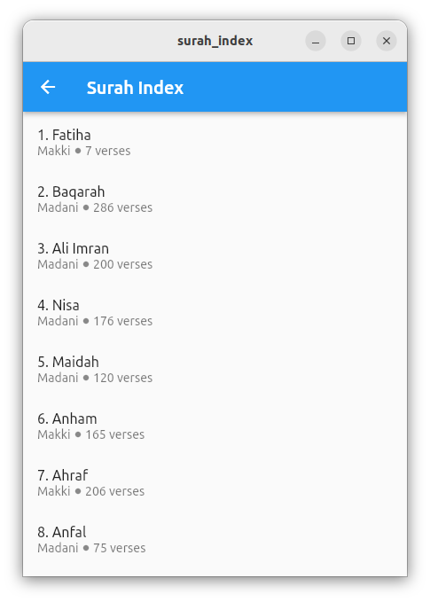
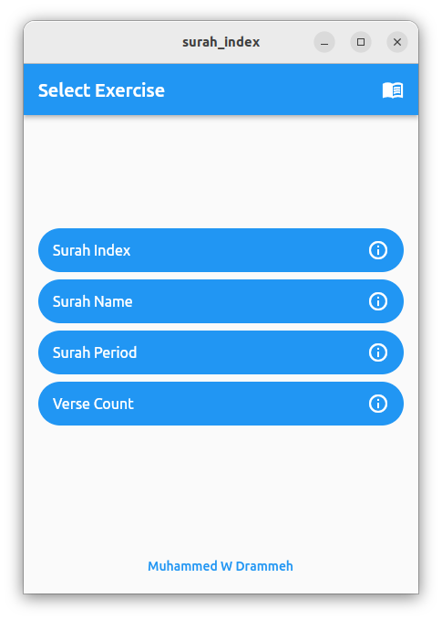
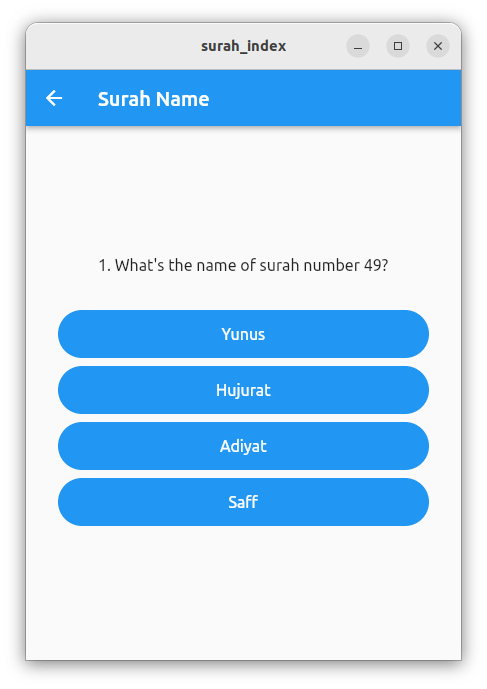
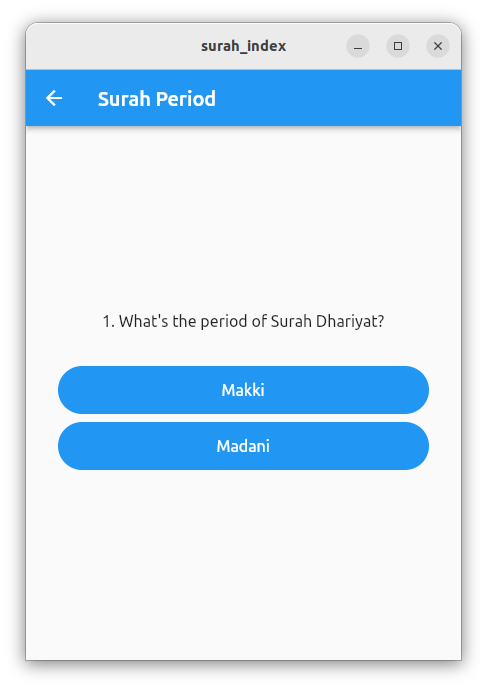
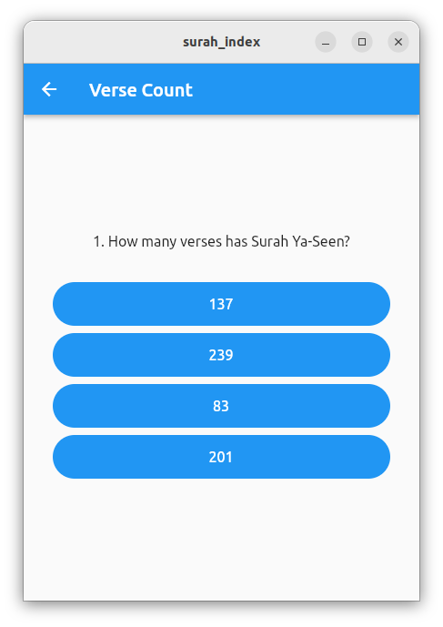

# Surah Index

An exercise to test your familiarity with the chapters in the Quran ("surahs").

Throughout this exercise, a randomly generated surah will be provided. You're to determine its name, index, period of revelation, or number verses based on the chosen category.

**The exercise is divided into 4 categories**:

## 1. Surah Index

In this exercise, you'll determine the index of a given surah.

## 2. Surah Name

In this exercise, you'll determine the name of a given surah.

## 3. Surah Period

In this exercise, you'll determine the period of revelation ["Makki", or "Madani"] of a given surah.

## 4. Verse Count

In this exercise, you'll determine the number of verses of a given surah.

